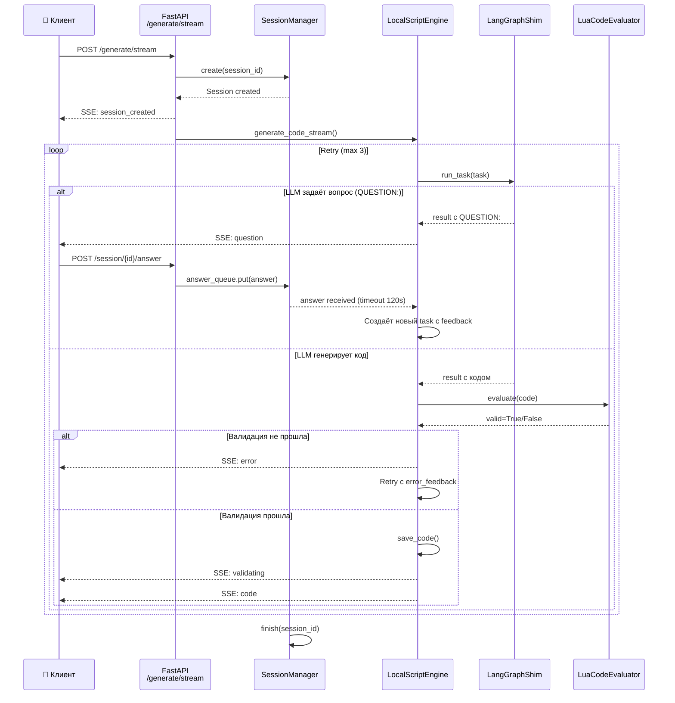
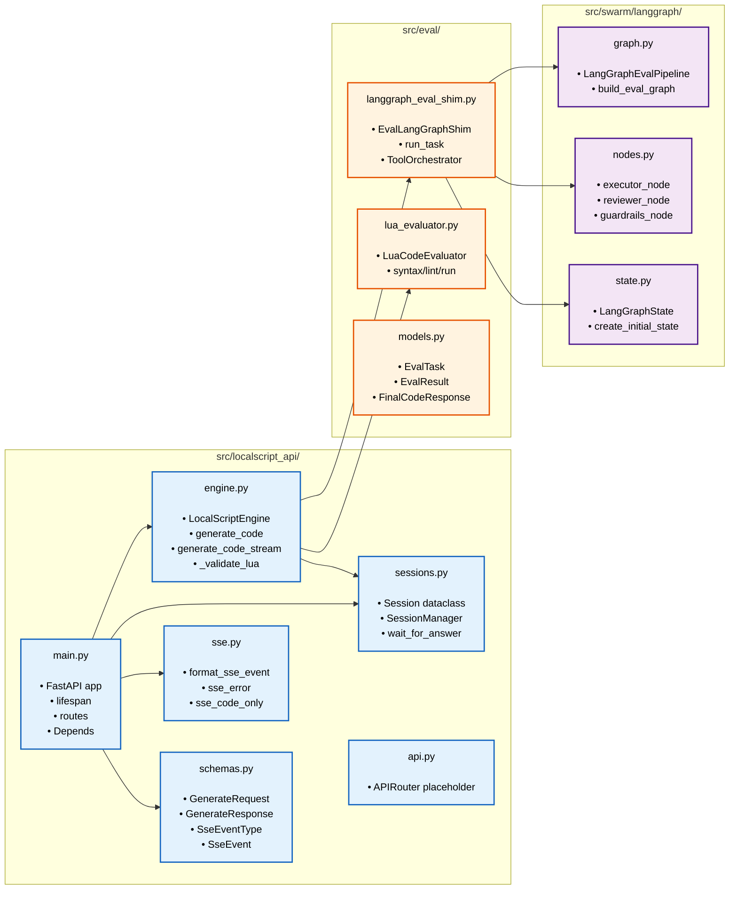

# C4 Architecture Diagrams — LocalScript API

## Level 1: System Context

```mermaid
graph LR
    Client["👤 Клиент\n(browser, curl, IDE)"]
    API["📦 LocalScript API\nFastAPI :8080"]
    LLM["🧠 LLM Backend\n(Ollama / llama.cpp)"]

    Client -->|"HTTP POST /generate\nSSE /generate/stream"| API
    API -->|"OpenAI-compatible API\nchat completions"| LLM
    LLM -->|"generated code\nstructured output"| API
    API -->|"SSE events:\nquestion, code, error| Client

    classDef client fill:#e1f5fe,stroke:#01579b,stroke-width:2px,color:#000
    classDef api fill:#fff3e0,stroke:#e65100,stroke-width:2px,color:#000
    classDef llm fill:#f3e5f5,stroke:#4a148c,stroke-width:2px,color:#000

    class Client client
    class API api
    class LLM llm
```

## Level 2: Containers

```mermaid
graph TB
    subgraph "LocalScript API (:8080)"
        direction TB

        FastAPI["🌐 FastAPI Application\n\nRoutes:\n• POST /generate\n• POST /generate/stream\n• POST /session/{id}/answer\n• GET /health"]

        Engine["⚙️ LocalScriptEngine\n\n• LangGraph shim\n• Lua validation\n• Session manager\n• Retry logic (max 3)"]

        FastAPI -->|"Depends()\nengine, session_mgr"| Engine
    end

    subgraph "External Services"
        LLM["🧠 LLM Backend\n(Ollama / llama.cpp)\n:11434 / :9192"]
        Lua["🔧 Lua Runtime\n\n• luac -p (syntax)\n• luacheck (lint)\n• lua (run)"]
    end

    Engine -->|"OpenAI API\nchat completions| LLM
    Engine -->|"subprocess\nsyntax/lint/run| Lua

    Client(("👤 Клиент")) -->|"HTTP/SSE| FastAPI

    classDef fastapi fill:#e3f2fd,stroke:#1565c0,stroke-width:2px,color:#000
    classDef engine fill:#fff3e0,stroke:#e65100,stroke-width:2px,color:#000
    classDef external fill:#f5f5f5,stroke:#616161,stroke-width:2px,color:#000
    classDef client fill:#e8f5e9,stroke:#2e7d32,stroke-width:2px,color:#000

    class FastAPI fastapi
    class Engine engine
    class LLM,Lua external
    class Client client
```

## Level 3: Components (LocalScriptEngine)

```mermaid
graph TB
    subgraph "LocalScriptEngine"
        direction TB

        LLMClient["🔌 LangChainLLMClient\n\n• ChatOpenAI wrapper\n• structured output\n• tool calling\n• OpenAI-compatible"]

        Shim["🔀 EvalLangGraphShim\n\n• EvalTask → LangGraphState\n• ToolOrchestrator\n• classify → executor → guardrails\n• state → ExecutionResult"]

        SessionMgr["🎫 SessionManager\n\n• create/get/finish session\n• asyncio.Queue for answers\n• wait_for_answer (timeout 120s)\n• clarification tracking"]

        Validator["✅ LuaCodeEvaluator\n\n• syntax: luac -p\n• lint: luacheck\n• run: lua + timeout\n• sequential validation"]

        LLMClient -->|"smart_client| Shim
        SessionMgr -.->|"session\nclarification"| Shim
        Shim -->|"generated code| Validator

        style LLMClient fill:#e1f5fe,stroke:#01579b,stroke-width:2px,color:#000
        style Shim fill:#fff3e0,stroke:#e65100,stroke-width:2px,color:#000
        style SessionMgr fill:#f3e5f5,stroke:#4a148c,stroke-width:2px,color:#000
        style Validator fill:#e8f5e9,stroke:#2e7d32,stroke-width:2px,color:#000
    end

    Retry["🔄 Retry Loop\n\nfor attempt in range(MAX_RETRIES + 1):\n  1. generate via LangGraph\n  2. check for QUESTION\n  3. validate Lua (syntax/lint/run)\n  4. save code or retry\n\nmax: 3 retries"]

    Shim -->|"code + result"| Retry
    Retry -->|"error feedback| Shim
    Validator -->|"valid/invalid"| Retry

    style Retry fill:#fce4ec,stroke:#880e4f,stroke-width:2px,stroke-dasharray: 5 5,color:#000
```

## Level 4: Code — LangGraph Eval Pipeline

```mermaid
graph TB
    subgraph "LangGraph Eval Pipeline"
        direction TB

        Start([Start])
        Classify["classify_task_node\n\nОпределяет последовательность ролей:\n• multi = [strategist, executor, reviewer]\n• executor = [executor]\n• strategist = [strategist]\n• reviewer = [reviewer]"]

        Strategist["strategist_subgraph\n\n• Анализ архитектуры\n• Генерация плана\n• FinalPlanResponse\n• tools: read_file, grep_search"]

        Executor["executor_subgraph\n\n• Tool-calling loop (max 10 rounds)\n• read_file, write_file, grep_search\n• FinalCodeResponse\n• clarification loop (max 3)"]

        Reviewer["reviewer_subgraph\n\n• Ревью кода\n• FinalReviewResponse\n• verdict: APPROVED/WARN/BLOCKER"]

        Guardrails["guardrails_node\n\n• Проверка архитектурных границ\n• blocker → error_handler"]

        ErrorHandler["error_handler\n\n• Обработка ошибок\n• retry_count < max_retries?"]

        End([End])

        Start --> Classify
        Classify -->|"role: strategist| Strategist
        Classify -->|"role: executor| Executor
        Classify -->|"role: reviewer| Reviewer

        Strategist -->|"plan ready| Executor
        Executor -->|"code ready| Reviewer
        Reviewer -->|"review done| Guardrails

        Guardrails -->|"ok| End
        Guardrails -->|"blocker| ErrorHandler

        ErrorHandler -->|"retry_count < max_retries| Executor
        ErrorHandler -->|"max_retries exceeded| End

        subgraph "Executor Subgraph — Clarification Loop"
            ExecNode["executor node\n\ngenerate code via tool-calling"]
            ExtractCode["extract_code_node\n\nИзвлекает код из response"]
            Clarification["clarification_node\n\nЕсли QUESTION: → ждём ответа\nmax_qa_rounds = 3"]

            ExecNode --> ExtractCode
            ExtractCode -->|"no question| AfterRole
            ExtractCode -->|"QUESTION:| Clarification
            Clarification -->|"answer received| ExecNode
        end

        Executor -.->|internal| ExecNode

        style Start fill:#e8f5e9,stroke:#2e7d32,stroke-width:3px,color:#000
        style End fill:#ffcdd2,stroke:#c62828,stroke-width:3px,color:#000
        style Classify fill:#fff3e0,stroke:#e65100,stroke-width:2px,color:#000
        style Strategist fill:#e1f5fe,stroke:#01579b,stroke-width:2px,color:#000
        style Executor fill:#fff3e0,stroke:#e65100,stroke-width:2px,color:#000
        style Reviewer fill:#f3e5f5,stroke:#4a148c,stroke-width:2px,color:#000
        style Guardrails fill:#fce4ec,stroke:#880e4f,stroke-width:2px,color:#000
        style ErrorHandler fill:#fff9c4,stroke:#f57f17,stroke-width:2px,color:#000
    end
```

## Level 4: Code — SSE Streaming Flow



## Level 4: Code — Модули и зависимости


